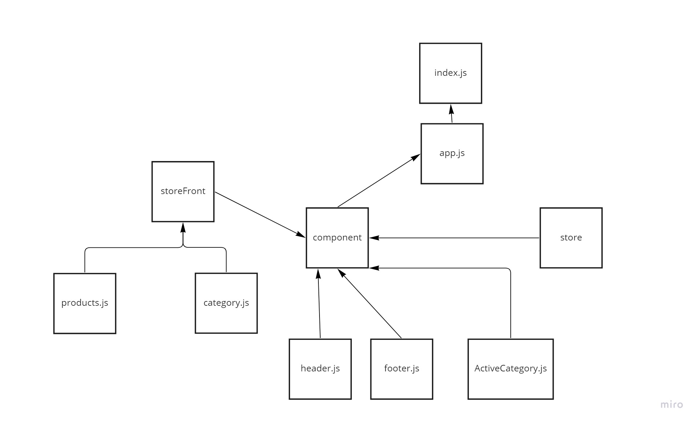

# storefront

To install redux
`npm i redux react-redux redux-devtools-extension`

## user/developer stories detail the major functionality for this app

+ As a user, I expect to see a list of available product categories in the store so that I can easily browse products
+ As a user, I want to choose a category and see a list of all available products matching that category
+ As a user, I want a clean, easy to use user interface so that I can shop the online store with confidence

Application Flow:

+ User sees a list of categories
+ Chooses a category and sees a list of products
+ Clicks the “Add to Cart” button on any product
+ Clicks the “Cart” link in the header
+ Sees a list of all products in the cart
+ Clicks the delete button on an item and sees the item removed
+ Changes the quantity selector on an item and sees the cart total change

## netlify Link Lab 36
[netlify link](https://6294c2aea0c1d60008f7d2e6--storied-granita-e88875.netlify.app/)

## netlify Link Lab 37

